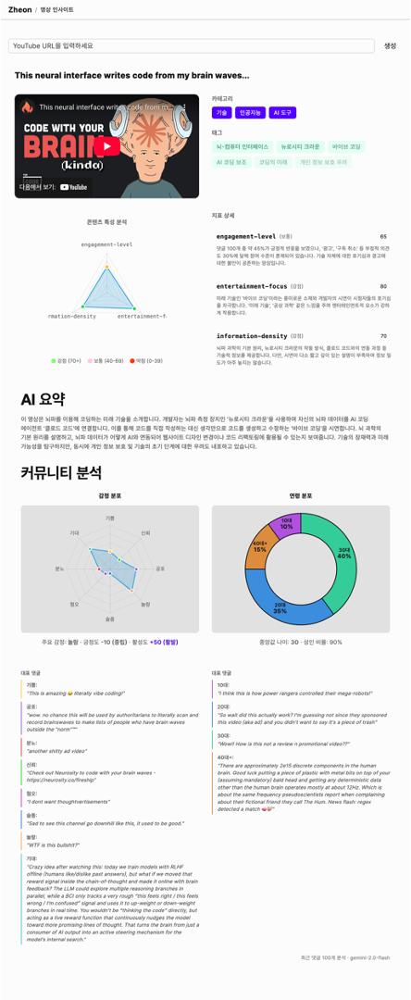

# Zheon - 유튜브 영상 인사이트

[라이브 데모](https://zheon.xiyo.dev)



---

## 빠른 시작

### 사전 요구사항

- Docker & Docker Compose

### API 키 발급

**1. Gemini API Key**

[Google AI Studio](https://aistudio.google.com/apikey)에서 API 키 발급

**2. Supabase Keys**

[Supabase](https://supabase.com)에서 프로젝트 생성 후 Settings → API에서 다음 키 확인:
- Project URL
- Publishable key (anon public)
- Secret key (service_role)

### 실행

```bash
# 클론
git clone https://github.com/XIYO/zheon.git
cd zheon

# 환경변수 설정
cp .env.sample .env
# .env 파일을 열어 발급받은 API 키 입력

# Docker Compose 실행
docker-compose -f docker/docker-compose.yml up -d
```

브라우저에서 http://localhost:3000 접속

---

## 링크

- [라이선스](./LICENSE)
- [개발 가이드](./DEVELOPMENT.md)
- [기여 가이드](./CONTRIBUTING.md)
